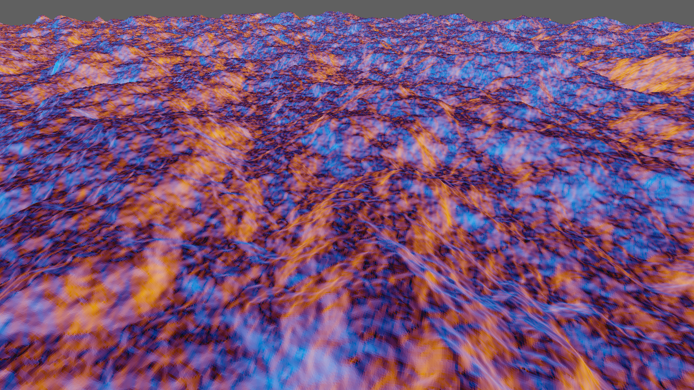
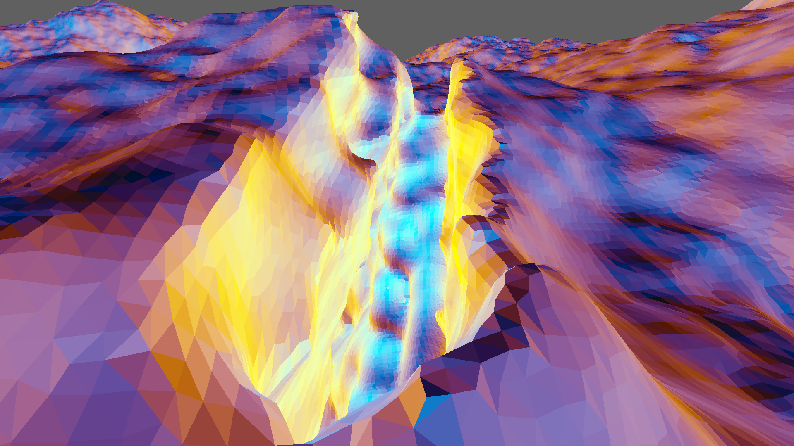

# Surface Nets

__Project creation date:__ 28.12.2018

## Description
This project generates a randomly generated 3D world with Surface Nets for the mesh generation. The world is infinite in 2 dimensions.\
The chunk generation is done with multithreaded C++ & SSE2.

## Technologies
* C#, C++
* MonoGame

## Remarks
Running this project is quite expensive for the CPU, GPU and RAM.

## Pictures

***

